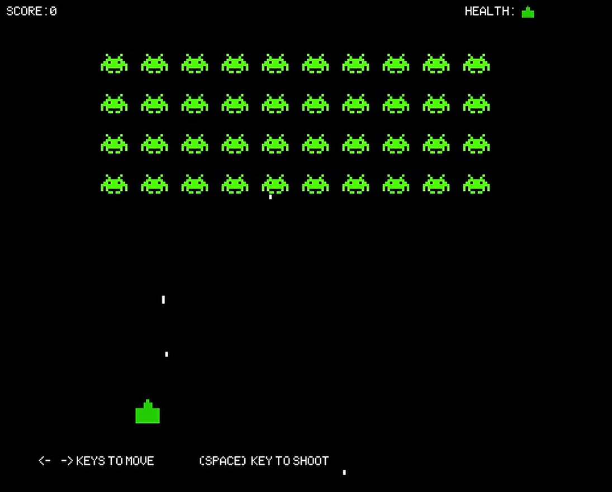

# Space Invaders using Love2D
A remake of the classic Space Invaders using Love2D

## Framework
This project is written in lua programming language and uses the Love2D framework.
 
Love2D framework is a free, open-source framework used in developing 2D video games.

## How to Play
Use the left and right arrow keys to move the player.
For left-handed people, use the a and d keys to move left and right.
Press the space key to shoot bullets.
If the player is hit by the aliens bullet, player loses and the game will be over.
Game will be over if the aliens reaches the player.
Eliminate all the aliens before it reaches down.

## Screenshots

## Distribution
Download the zip file to play.
